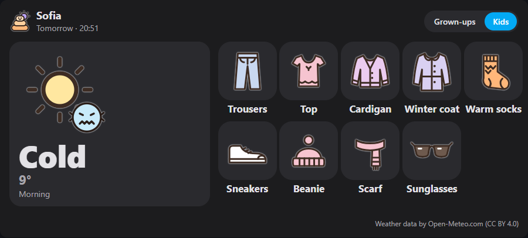

# Layers Weather card for Home Assistant

**What to wear for the weather**, on a wall screen by the front door: how many layers, which shoes, hat or not,
umbrella or not, and what to take with you, for the morning, afternoon and evening. From 19:30 it shows tomorrow,
so clothes can be laid out the evening before.

There are two views on the same card, with a switch at the top:

- **Grown-ups** (the default): the day in a few words, the weather at a glance, the parts of the day, what to
  wear now and what to put in the bag.
- **Kids**: one big weather word with a face, and big pictures of what to put on, for children who can't read yet.

It is the Home Assistant version of [Layers Weather](https://weather.ecortex.eu), and it uses the same rules and
words: English, German, French, Spanish and Bulgarian.


| Kids view | Dark theme |
|---|---|
|  |  |

## Install

### With HACS (recommended)

1. In Home Assistant, open **HACS**.
2. Open the menu (⋮, top right) → **Custom repositories**.
3. Repository: `https://github.com/eybox/layers-weather-card`, type: **Dashboard**. Add it.
4. Find **Layers Weather** in HACS, open it and **Download**.
5. Reload the browser page when HACS asks.

### By hand

1. Download `layers-weather-card.js` from the [latest release](https://github.com/eybox/layers-weather-card/releases/latest).
2. Put it in your Home Assistant `config/www/` folder.
3. **Settings → Dashboards → ⋮ → Resources → Add resource**: URL `/local/layers-weather-card.js`, type
   **JavaScript module**.

## Add it to a dashboard

Edit a dashboard, **Add card**, and pick **Layers Weather**. Or in YAML:

```yaml
type: custom:layers-weather-card
```

That's all it needs: it uses your home's location, and Home Assistant's language and units. Everything else is
optional, and the card's visual editor has all of it:

```yaml
type: custom:layers-weather-card
entity: zone.home          # where: a zone, person or device tracker with a position
name: Home                 # the place's name on the card (default: your location's name)
mode: everyone             # the view shown first: everyone (grown-ups) or kids
show_mode_switch: true     # the grown-ups / kids switch on the card
language: en               # en, de, fr, es or bg (default: Home Assistant's language)
units: metric              # metric or imperial (default: Home Assistant's units)
sensitivity: normal        # cold (dress warmer), normal or hot (dress lighter)
style: women               # the clothes pictures: women or men (girl or boy in the kids view)
eyes: brown                # brown, hazel, green or blue: lighter eyes get sunglasses sooner
allergies: false           # tissues on high-pollen days, and a mask sooner when the air is poor
```

The switch remembers the last view on each screen (each tablet or phone keeps its own).

## Weather data and privacy

- The forecast comes from [Open-Meteo](https://open-meteo.com/) (CC BY 4.0). Its free API is for non-commercial
  use, and the credit line on the card must stay.
- The card asks Open-Meteo straight from your browser. It sends your home's position **rounded to about 1 km**,
  never the exact spot, and nothing else. There is no account, no tracking, and nothing is stored anywhere except
  the last view on each screen (in that browser).
- It refreshes the forecast every 30 minutes, and the time at your place every minute.

## Notes

- Weather warnings (MeteoAlarm, the US National Weather Service) are in the web app, not yet in the card.
- Found a problem? [Open an issue](https://github.com/eybox/layers-weather-card/issues).

Copyright © 2026 eybox. All rights reserved. You may install and use the card with Home Assistant; please don't
redistribute or modify it.
