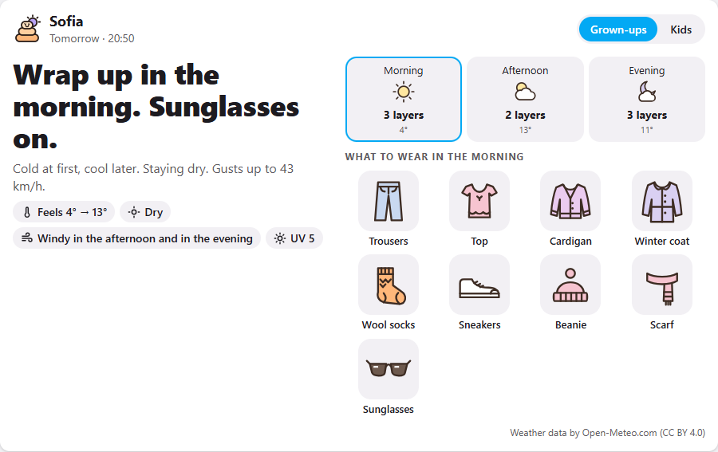
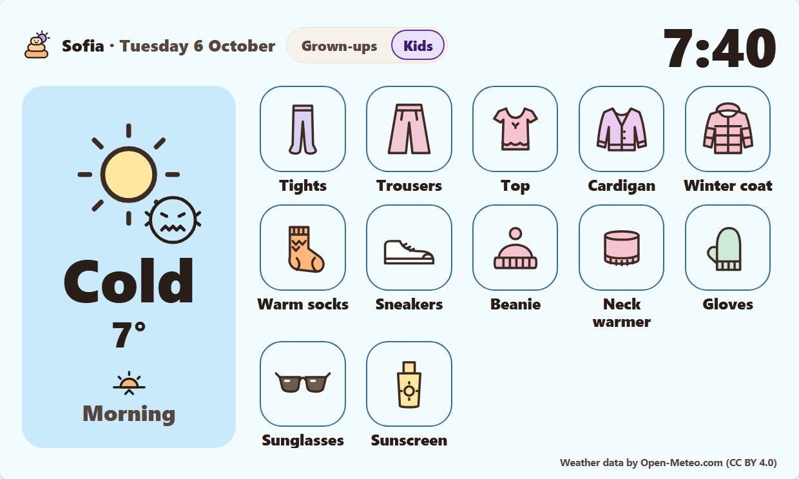
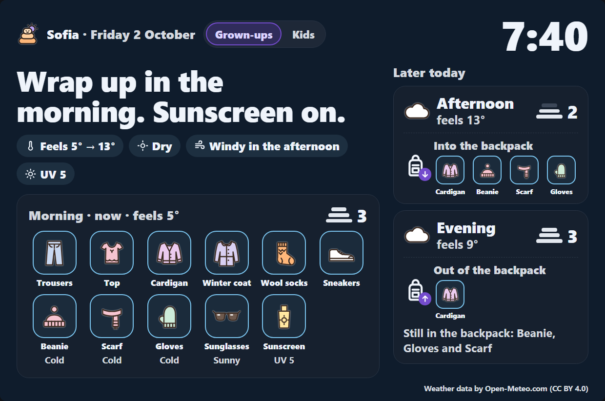
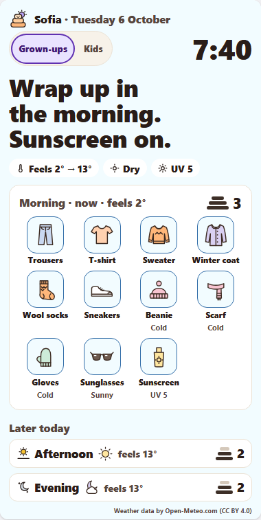

# Layers Weather card for Home Assistant

[](https://hacs.xyz/docs/faq/custom_repositories/)
[](https://github.com/eybox/layers-weather-card/releases/latest)

**Know what to wear before you walk out the door.** A dashboard card that turns the weather forecast into clothes:
how many layers, which shoes, hat or not, umbrella or not, and what to put in the bag, for grown-ups and for kids.



## What it is

Layers Weather is a weather app that answers one question: **what should I wear today?** The forecast is still
there, but it comes second. This card brings it to your Home Assistant dashboard, ideally on a tablet by the front
door, so the whole family sees it on the way out.

It plans the day in three parts (morning, afternoon, evening) and tells you:
- **what to wear now**: the layers, trousers or shorts, shoes and socks, hat, scarf and gloves;
- **what to take with you**: the umbrella for the afternoon rain, sunglasses for later, water on a hot day;
- **why**, in a few plain words: "Cold at first, warm later. Staying dry."

From 19:30 tomorrow is there too, so clothes can be laid out the evening before. It is the Home Assistant version
of the [Layers Weather web app](https://weather.ecortex.eu)'s TV and wall screen: the same screen, the same rules
and words, in English, German, French, Spanish and Bulgarian.

## Why it exists

Weather apps give you numbers: "14°, 60%, 25 km/h". Everyone then has to turn those numbers into clothes
themselves, every morning, and children can't do that at all. Layers Weather does that step for you, and says why,
so people also learn to read the weather.

The rules behave like a sensible parent would: better a jacket too many than a cold child, one shirt for the whole
day, no umbrella in strong wind, a waterproof coat when it's too windy for one, and nothing in the bag that nobody
would carry.

## Who it's for

- **Families with children from 3 to 12**, including children who can't read yet: the **Kids** view has one big
  weather word with a face, and big pictures of what to put on.
- **Grown-ups who want the answer, not the forecast**: the **Grown-ups** view says it in a few words.
- **Anyone with a Home Assistant dashboard by the door**: a wall tablet, a kitchen display or a phone.
- **People who feel the cold (or the heat) more than most**, and people with hay fever: a setting makes the advice
  warmer or lighter, and another adds tissues and a mask on high-pollen or poor-air days.

It is made for places with seasons (the temperate zones, from Scandinavia to the Mediterranean and similar climates
elsewhere), not for deserts, the tropics or polar regions.

## What you'll see

One card, two views, with a switch at the top, and a big clock:

- **Grown-ups** (the default): the day in a few words, then what to wear now, as big pictures, with the layers.
  Beside it, the backpack's day: what to pack, each thing with when it's needed ("afternoon", "17–22"), then each
  later part with its weather and layers and what to take out of the backpack then. From 19:30 tomorrow takes that
  place, with "Pack tonight for tomorrow"; from 22:00 the card shows tomorrow.
- **Kids**: one big weather word with a face, big pictures of what to put on, and the backpack in its own column
  (with when each thing is needed). From 19:30 it shows tomorrow morning's clothes and what to pack tonight.

It looks like the app's TV screen, in the colour of the weather (warm for sun, grey for cloud, blue for cold). It
follows your Home Assistant theme, light or dark, or, if you like, the sun: light by day, dark after sunset, as on
a TV (see `appearance`). On a wall tablet it is the TV screen; in a narrow dashboard column or on a phone the same
pieces stack in one column.

<table>
  <tr>
    <th>Kids view</th>
    <th>Dark theme</th>
    <th>On a phone</th>
  </tr>
  <tr>
    <td></td>
    <td></td>
    <td></td>
  </tr>
</table>

## Contents

- [What it is](#what-it-is) · [Why it exists](#why-it-exists) · [Who it's for](#who-its-for) · [What you'll see](#what-youll-see)
- [Before you start](#before-you-start)
- [Install](#install): [with HACS](#option-a-with-hacs-recommended), [by hand](#option-b-by-hand-without-hacs),
  [YAML-mode dashboards](#if-your-dashboards-are-in-yaml-mode)
- [Add the card to a dashboard](#add-the-card-to-a-dashboard)
- [Settings](#settings)
- [Examples](#examples)
- [On a wall tablet](#on-a-wall-tablet)
- [Update](#update) · [Troubleshooting](#troubleshooting) · [Remove](#remove)
- [Weather data and privacy](#weather-data-and-privacy)

## Before you start

You need:

1. **Home Assistant 2024.8 or newer.** To check: **Settings → About**.
2. **Your home's location set in Home Assistant.** The card uses it for the weather. To check:
   **Settings → System → General**, and look at the map. (Or point the card at another place, see
   [Settings](#settings).)
3. **Internet on the screen that shows the card.** The card gets the forecast from
   [Open-Meteo](https://open-meteo.com/) straight from that screen's browser, so a tablet on a guest or blocked
   network must be able to reach `api.open-meteo.com`.
4. **For the easy install: [HACS](https://hacs.xyz/)** (the Home Assistant Community Store). If you don't have it,
   either [install HACS first](https://hacs.xyz/docs/use/) or use the [install by hand](#option-b-by-hand-without-hacs).

## Install

### Option A: with HACS (recommended)

HACS installs the card, tells Home Assistant about it, and offers updates later.

1. In Home Assistant, open **HACS** from the sidebar.
2. Top right, open the menu **⋮** and choose **Custom repositories**.
3. Fill in the form:
   - **Repository:** `https://github.com/eybox/layers-weather-card`
   - **Type** (or *Category*): **Dashboard**
4. Press **Add**, then close the window.
5. In the HACS search box, type **Layers Weather** and open it.
6. Press **Download** (bottom right), then **Download** again to confirm.
7. When HACS asks, **reload the page**. If it doesn't ask, reload anyway: press **Ctrl + F5** (Windows, Linux) or
   **Cmd + Shift + R** (Mac). In the Home Assistant phone app, see [the card doesn't appear](#the-card-doesnt-appear-or-custom-element-doesnt-exist-layers-weather-card).

That's it. Go on to [Add the card to a dashboard](#add-the-card-to-a-dashboard).

> **Using YAML-mode dashboards?** HACS can't register the card for you there. Do the extra step in
> [If your dashboards are in YAML mode](#if-your-dashboards-are-in-yaml-mode).

### Option B: by hand (without HACS)

You'll put one file in Home Assistant's `www` folder, then tell Home Assistant to load it.

**1. Download the card.** Open the [latest release](https://github.com/eybox/layers-weather-card/releases/latest)
and download **`layers-weather-card.js`** (under *Assets*).

**2. Put it in the `www` folder.** It goes in `config/www/`, the same folder as your `configuration.yaml` plus
`/www`. Use whichever way you already edit Home Assistant's files:
- the **File editor** or **Studio Code Server** add-on (**Settings → Add-ons**): open the `config` folder, create a
  folder called `www` if there isn't one, and upload the file into it;
- or the **Samba share** add-on: open the `config` share on your computer, same thing.

The file should end up as `config/www/layers-weather-card.js`.

> **Did you just create the `www` folder?** Restart Home Assistant once (**Settings → System → ⟳ Restart**, top
> right). Home Assistant only notices a new `www` folder when it starts.

**3. Tell Home Assistant to load it** (skip this if your dashboards are in YAML mode, see the next section):
1. **Resources** are hidden until *Advanced mode* is on. Click your **user name** (bottom left), and switch on
   **Advanced mode**.
2. Go to **Settings → Dashboards**, open the menu **⋮** (top right) and choose **Resources**.
3. Press **+ Add resource** (bottom right) and fill in:
   - **URL:** `/local/layers-weather-card.js?v=0.5.11`
   - **Resource type:** **JavaScript module**
4. Press **Create**, then reload the page (**Ctrl + F5** / **Cmd + Shift + R**).

The `?v=0.5.11` at the end is the version. When you update the card by hand later, change it to the new version
number, so every screen loads the new file instead of an old saved copy.

### If your dashboards are in YAML mode

Most setups aren't. You are in YAML mode if your `configuration.yaml` has this:

```yaml
lovelace:
  mode: yaml
```

In YAML mode, Home Assistant ignores the **Resources** page, so the card has to be listed in
`configuration.yaml` instead:

1. Open `configuration.yaml` (with the File editor or Studio Code Server add-on).
2. Under `lovelace:`, add a `resources:` list with the card. Use the line that matches how you installed it:

   ```yaml
   lovelace:
     mode: yaml
     resources:
       # Installed with HACS:
       - url: /hacsfiles/layers-weather-card/layers-weather-card.js
         type: module
       # Or installed by hand (use this line instead of the one above):
       # - url: /local/layers-weather-card.js?v=0.5.11
       #   type: module
   ```

   If you already have a `resources:` list, add just the `- url: …` and `type: module` lines to it.
3. Check the file: **Developer tools → YAML → Check configuration**. It should say *Configuration will not prevent
   Home Assistant from starting*.
4. Restart Home Assistant (**Settings → System → ⟳ Restart**), then reload the page.

## Add the card to a dashboard

**With the dashboard editor:**
1. Open the dashboard, and top right press **✏️ Edit dashboard** (or **⋮ → Edit dashboard**).
2. Press **+ Add card**, type **Layers Weather** in the search box, and pick it.
3. The card shows your home's weather straight away. Change anything you like in the settings on the left
   (see [Settings](#settings)), then press **Save**, then **Done**.

**In YAML** (in the card's *Code editor*, or in your dashboard's YAML file), this is all it needs:

```yaml
type: custom:layers-weather-card
```

It uses your home's location, and Home Assistant's language and units.

## Settings

Everything is optional. The card's visual editor has all of these; in YAML, add the lines you want.

| Setting | What it does | Values | Default |
|---|---|---|---|
| `entity` | Where the weather is for. | A `zone`, `person` or `device_tracker` with a position | `zone.home` |
| `name` | The place's name at the top of the card. | Any text | Its own name (your home's name in Home Assistant for `zone.home`) |
| `mode` | The view the card starts in. | `everyone` (grown-ups), `kids` | `everyone` |
| `show_mode_switch` | Show the grown-ups / kids switch on the card. | `true`, `false` | `true` |
| `language` | The card's language. | `en`, `de`, `fr`, `es`, `bg` | Home Assistant's language (English if it isn't one of these) |
| `units` | °C and km/h, or °F and mph. | `metric`, `imperial` | Home Assistant's unit system |
| `sensitivity` | How warm the advice is. | `cold` (dresses you warmer), `normal`, `hot` (lighter) | `normal` |
| `commute` | How you get around. | `walk`, `bike` (3° warmer and always windproof), `car` (car or transit: 3° lighter) | `walk` |
| `child_age` | The kids' view: the children's age group. 3–5-year-olds are dressed a little warmer. | `young` (3–5), `school` (6–12) | `school` |
| `style` | The clothes pictures. Kids see girl / boy. | `women`, `men` | Neutral pictures |
| `summer` | With `style: women`: what to show on warm days. `dress` puts on a dress only on properly hot days (25 °C / 77 °F and up); other warm days stay top and skirt. | `skirt` (top & skirt), `shorts` (top & shorts), `dress` | `skirt` |
| `eyes` | Eye colour: lighter eyes get sunglasses sooner. | `brown`, `hazel`, `green`, `blue` | `brown` |
| `allergies` | Tissues on high-pollen days, and a mask sooner when the air is poor. | `true`, `false` | `false` |
| `appearance` | Light or dark. | `theme` (like your dashboard), `sun` (light by day, dark after sunset at the place), `light`, `dark` | `theme` |

The switch remembers the last view on each screen, for each place: a wall tablet left on **Kids** stays on Kids,
while your phone stays on **Grown-ups**. If you change `mode` in the settings later, the card starts in the new
`mode` again.

A setting the card can't use (a typo such as `sensitivity: warm`) shows Home Assistant's red error card, naming the
setting and the values it accepts.

## Examples

**The whole family, at home** (the simplest):

```yaml
type: custom:layers-weather-card
```

**A kids' wall tablet**, always in the kids view, with no switch to fiddle with:

```yaml
type: custom:layers-weather-card
mode: kids
show_mode_switch: false
style: women   # girl pictures (use men for boy pictures)
```

**Women's clothes, with a dress on hot days:**

```yaml
type: custom:layers-weather-card
style: women
summer: dress
```

**Someone who always feels the cold, in German:**

```yaml
type: custom:layers-weather-card
sensitivity: cold
language: de
```

**Wherever a person is** (their phone must report a location to Home Assistant):

```yaml
type: custom:layers-weather-card
entity: person.anna
name: Anna
```

**A holiday home or grandma's house:** first add a zone for it (**Settings → Areas, labels & zones → Zones →
+ Add zone**), then:

```yaml
type: custom:layers-weather-card
entity: zone.grandma
```

## On a wall tablet

- **A full-screen card:** make a new view for the tablet (**Edit dashboard → +** at the top), set its
  **View type** to **Panel (single card)**, and put this card on it.
- **Keep the screen on:** a kiosk browser such as *Fully Kiosk Browser* (Android), or the tablet's own settings,
  can keep the screen awake and reload the page if it ever loses the connection.
- **Leave it running:** the card gets a new forecast every 30 minutes and keeps the time at your place every
  minute, so it can stay on for days. At 19:30 tomorrow appears by itself, and at 22:00 it takes over.

## Update

- **With HACS:** when there's a new version, HACS shows **Update** (also under **Settings → Updates**). Press it,
  then reload the page (**Ctrl + F5** / **Cmd + Shift + R**) on each screen.
- **By hand:** download the new `layers-weather-card.js`, replace the old file in `config/www/`, and change the
  number at the end of the resource URL (for example `?v=0.1.1` to `?v=0.1.2`). In YAML mode, change it in
  `configuration.yaml` and restart.

## Troubleshooting

### The card doesn't appear, or "Custom element doesn't exist: layers-weather-card"

Home Assistant hasn't loaded the card's file.
1. **Reload the page hard:** **Ctrl + F5** / **Cmd + Shift + R**. In the **Home Assistant phone app**, open the
   app's settings → **Companion app** → **Debugging** (or *Troubleshooting*) → **Reset frontend cache**, then
   pull down to reload.
2. **Check the resource:** with *Advanced mode* on, **Settings → Dashboards → ⋮ → Resources** should list
   `/hacsfiles/layers-weather-card/layers-weather-card.js` (HACS) or `/local/layers-weather-card.js?v=…` (by hand),
   type *JavaScript module*. If it isn't there, add it (see [by hand, step 3](#option-b-by-hand-without-hacs)).
3. **In YAML mode:** check the `resources:` lines in `configuration.yaml` (see
   [YAML mode](#if-your-dashboards-are-in-yaml-mode)), and restart.
4. **Installed by hand and just made the `www` folder?** Restart Home Assistant once.
5. **Still nothing:** open `https://YOUR-HOME-ASSISTANT/local/layers-weather-card.js` (or `/hacsfiles/…`) in the
   browser. If you get an error page, the file isn't where Home Assistant looks for it.

### "Set a place…"

The card can't find a position. Set your home's location in **Settings → System → General**, or give the card an
`entity` that has one (a zone, or a person whose phone reports a location).

### "… has no position right now"

The card's `entity` (say, a person) doesn't report a location at the moment, for example when their phone's
location is off. The card says so rather than showing the weather at home. Pick a zone instead, or check the
person's location in Home Assistant.

### "Could not get the weather. Check your connection."

The screen showing the card couldn't reach Open-Meteo. Check that this device is online and allowed to reach
`api.open-meteo.com` (guest networks, ad blockers and firewalls sometimes block it). The card tries again by
itself every few minutes.

### The card is in the wrong language, or in °F / °C

It follows Home Assistant's language (your profile) and unit system. To pick your own, set `language` and
`units` (see [Settings](#settings)).

### The visual editor is blank

Close the editor, reload the page, and open it again. If it's still blank, press **Show code editor** and edit
the settings in YAML (see [Settings](#settings)), and please [report it](https://github.com/eybox/layers-weather-card/issues).

### Something else

[Open an issue](https://github.com/eybox/layers-weather-card/issues) with your Home Assistant version, the card
version (**HACS → Layers Weather**, or the browser console, which shows `LAYERS-WEATHER-CARD 0.5.11`), the
device and browser showing it, and a screenshot.

## Remove

1. Remove the card from your dashboards (**Edit dashboard**, then the card's **⋮ → Delete**).
2. **With HACS:** **HACS → Layers Weather → ⋮ → Remove**, then reload the page.
3. **By hand:** delete the resource (**Settings → Dashboards → ⋮ → Resources**), or the lines in
   `configuration.yaml` in YAML mode, and delete `config/www/layers-weather-card.js`.

## Weather data and privacy

- The forecast comes from [Open-Meteo](https://open-meteo.com/) (CC BY 4.0). Its free API is for non-commercial
  use, and the credit line at the bottom of the card must stay.
- The card asks Open-Meteo **straight from the browser** of the screen showing it. It sends only your home's
  position, **rounded to about 1 km** (never the exact spot). There is no account and no tracking, and nothing is
  sent to anyone else.
- The only thing it keeps is the last view (grown-ups or kids) on each screen, in that browser.
- Weather warnings (MeteoAlarm, the US National Weather Service) are in the [web app](https://weather.ecortex.eu),
  not yet in the card.

## License

Copyright © 2026 eybox. All rights reserved. You may install and use this card with your own Home Assistant;
please don't redistribute or modify it.
